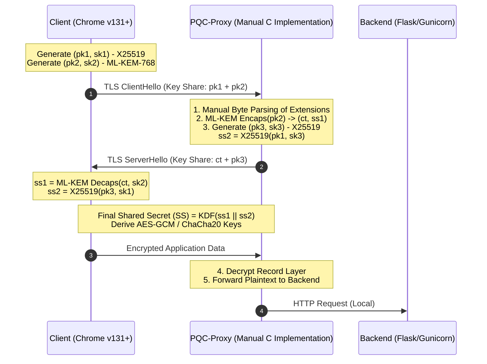

# PQC-TLS 1.3 Handshake Prototype (ML-KEM)

## Overview

An experimental, byte-level implementation of a TLS 1.3 reverse proxy, focusing on the integration of Post-Quantum Cryptography (PQC). This project handles the TLS record layer and handshake state machine manually to support the hybrid key agreement: **X25519-MLKEM768**.

The implementation emphasizes Manual Byte Marshalling, where every byte of the TLS handshake (from ClientHello parsing to ServerHello construction) is manually assembled in accordance with RFC 8446.

To ensure FIPS 203 Compliance, the project implements the standardized ML-KEM (formerly Kyber) for quantum-resistant key encapsulation.

The Hybrid Key Exchange logic demonstrates the precise integration of classical ECDH (X25519) and PQC (ML-KEM) shared secrets through a custom Key Derivation Function (KDF) flow.

## Standards and Specifications

IETF Draft:
[X25519MLKEM768 Definition](https://www.ietf.org/archive/id/draft-kwiatkowski-tls-ecdhe-mlkem-02.html)

NIST FIPS 203: [Module-Lattice-Based Key-Encapsulation Mechanism Standard
](https://csrc.nist.gov/pubs/fips/203/final)

## Architecture

The following diagram illustrates how the proxy handles the hybrid key exchange. It ensures that the final session key is derived from both classical and post-quantum secrets, providing quantum-resistance while maintaining backward compatibility.

The PQC-Proxy acts as a Cryptographic Termination Point. It handles the PQC handshake at the edge, allowing internal microservices to remain unchanged.

## Setup and Usage

### Requirement

- Runtime: Python 3.10.12, NodeJS 22.7.0
- Core Logic: C (Compiled with CMake 3.12+)
- Crypto Context: OpenSSL 3.0.2 (Used only for cryptographic primitives, not protocol logic)
- Browser: Chrome v131+ (for PQC hybrid support)

### Installation

1. **Certificate Preparation (Optional):** Place your DER-formatted X.509 certificate and PEM key into `backend/src/cert`, To ensure compatibility with the manual record layer parsing, the certificate must be in DER format while the private key should be in PEM format.

2. **Settings:** Update the corresponding filenames in `backend/setting.conf`.

3. **Deployment:** Run the `sudo ./setup` script to initialize the environment.

4. **Access:** Open Chrome and navigate to `https://127.0.0.1`. The server logs are output to `backend/access.log` and `backend/error.log` for debugging and protocol verification.

## Important Considerations

- **Experimental Scope:** This project is a functional prototype designed for protocol verification and educational purposes. It focuses on the correctness of the handshake flow rather than high-concurrency performance.

- **Security Boundary:** The connection between the proxy and the Flask backend is currently plaintext, intended for local or internal VPC use.

## Acknowledgements
This project makes use of the following open-source projects:
- [pq-crystals/kyber](https://github.com/pq-crystals/kyber)
- [pq-code-package/mlkem-native](https://github.com/pq-code-package/mlkem-native)
